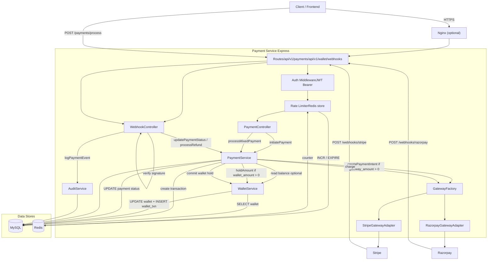

# paymentflow

Multi-payment service with **wallet + gateway (Stripe/Razorpay) mixed payments**, backed by **MySQL** (transactions/wallet) and **Redis** (rate limiting).

## Tech stack

- Node.js + TypeScript
- Express
- TypeORM + MySQL
- Redis (rate limit store)
- Stripe + Razorpay SDKs

## Data flow diagram (Mermaid)



## API overview

Base URL: `http://localhost:3000`

### Auth

All `/api/v1/*` routes require:

- Header: `Authorization: Bearer <jwt>`
- The JWT is verified with `JWT_SECRET` and is expected to contain at least `id`, `email`, `role`.

### Payments

- `POST /api/v1/payments/initiate`
  - Creates a `PaymentTransaction` using an **idempotency key**.
  - If `use_wallet=true`, splits the amount into `wallet_amount` and `gateway_amount`.
  - If `gateway_amount > 0` and `preferred_gateway` is provided, creates a gateway payment intent.

- `POST /api/v1/payments/process`
  - Executes the mixed payment:
    - holds wallet amount (in-memory hold)
    - charges gateway (Stripe/Razorpay)
    - commits wallet deduction
    - marks transaction `COMPLETED` (or rolls back hold on failure)

- `GET /api/v1/payments/transaction/:transaction_id`
  - Returns transaction status/details (public view).

- `POST /api/v1/payments/refund/:transaction_id`
  - Present in routes; refund logic is currently stubbed in controller.

### Wallet

- `GET /api/v1/wallet/balance/:user_id`

### Webhooks (no auth)

- `POST /webhooks/stripe`
  - Uses **raw** body for Stripe signature verification.
- `POST /webhooks/razorpay`
  - Uses JSON body + HMAC verification via `RAZORPAY_WEBHOOK_SECRET`.

## Environment variables

Create a `.env` file in the repo root (or set env vars in your runtime):

```bash
# App
PORT=3000
NODE_ENV=development
ALLOWED_ORIGINS=http://localhost:5173,http://localhost:3000
LOG_LEVEL=info

# MySQL
DB_HOST=localhost
DB_PORT=3306
DB_USER=root
DB_PASSWORD=your_db_password
DB_NAME=payment_system

# Redis (rate limiter)
REDIS_HOST=localhost
REDIS_PORT=6379
REDIS_PASSWORD=

# JWT
JWT_SECRET=change-me
JWT_EXPIRES_IN=24h

# Stripe
STRIPE_SECRET_KEY=sk_test_...
STRIPE_PUBLISHABLE_KEY=pk_test_...
STRIPE_WEBHOOK_SECRET=whsec_...

# Razorpay
RAZORPAY_KEY_ID=rzp_test_...
RAZORPAY_KEY_SECRET=...
RAZORPAY_WEBHOOK_SECRET=...
```

## Run locally (Node)

```bash
npm install
npm run dev
```

## Run with Docker

This repo includes `docker-compose.yml` with:

- `payment-service` (this app)
- `mysql`
- `redis`
- `nginx` (optional reverse proxy)

```bash
docker compose up --build
```

## Scripts

- `npm run dev`: start in watch mode
- `npm run build`: TypeScript compile to `dist/`
- `npm start`: run compiled server
- `npm test`: run Jest
- `npm run lint`: ESLint
- `npm run format`: Prettier
